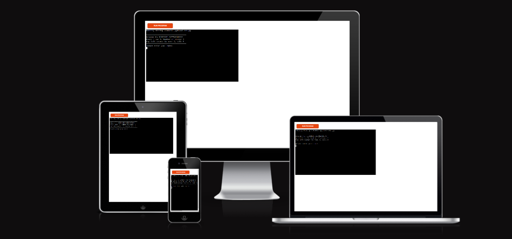
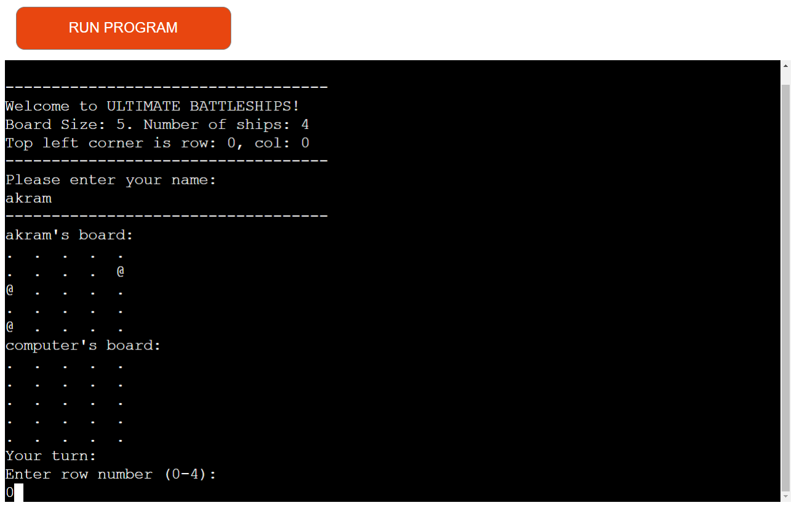
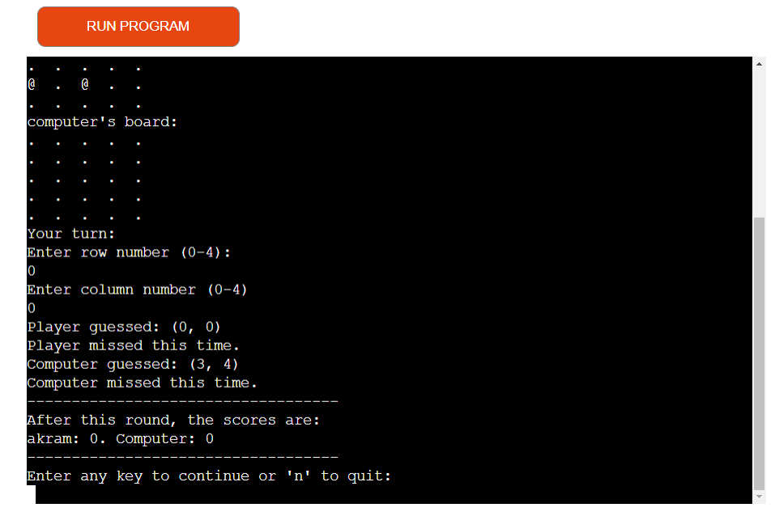
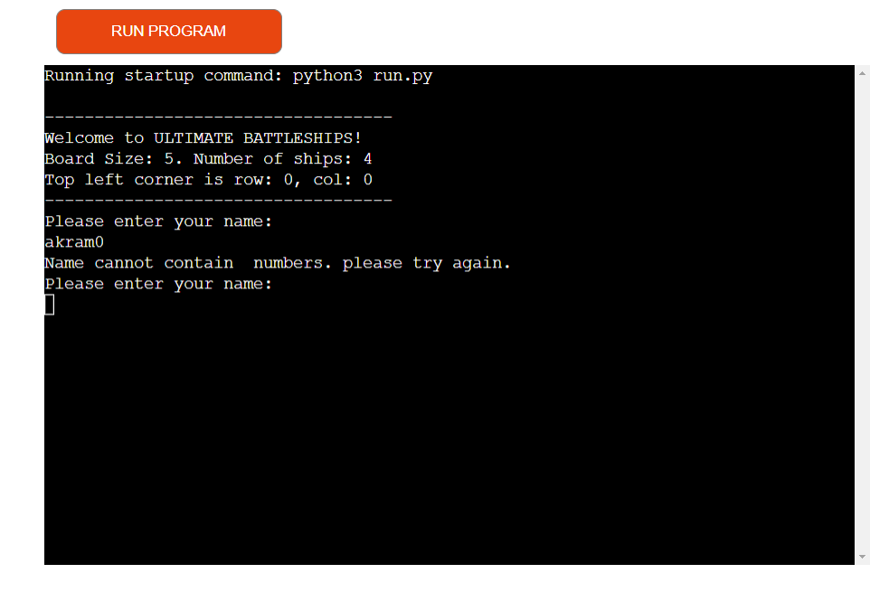
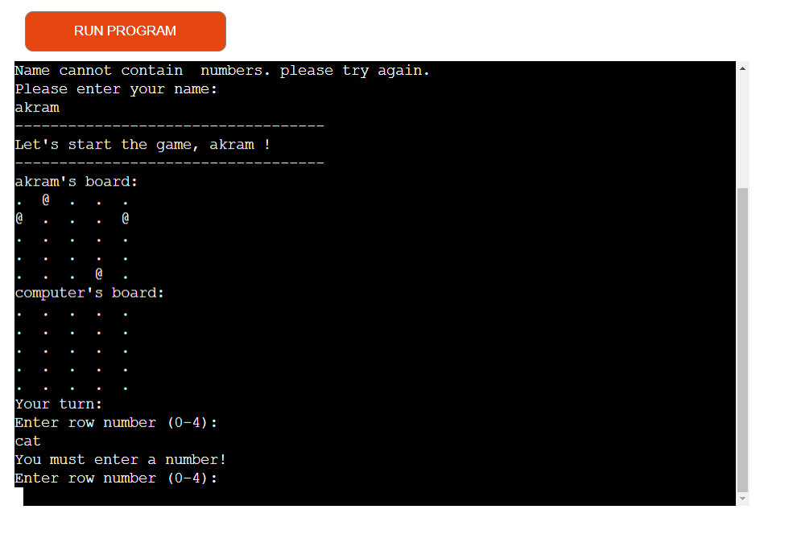
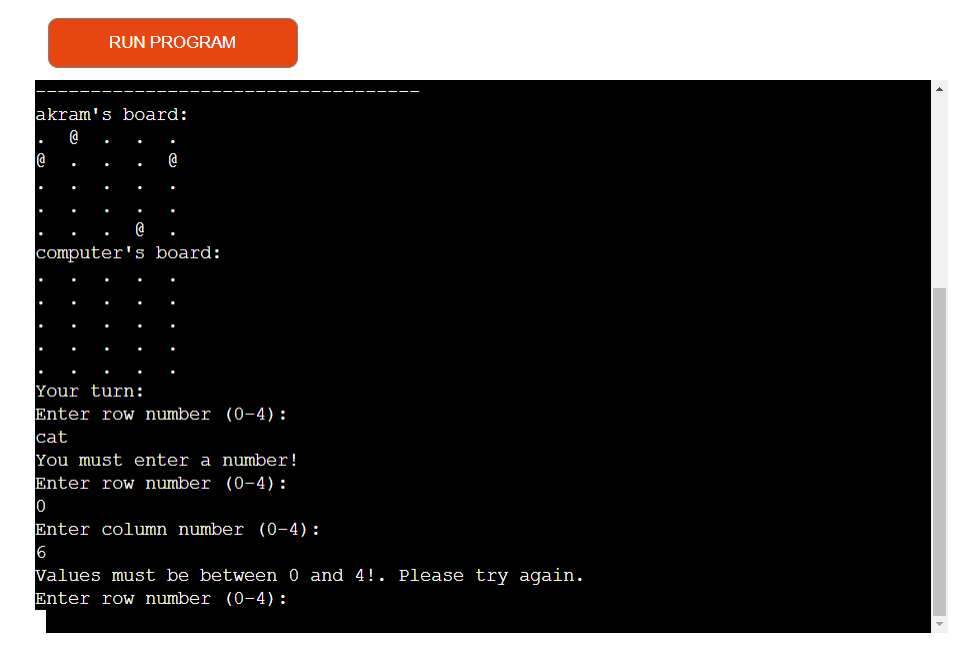
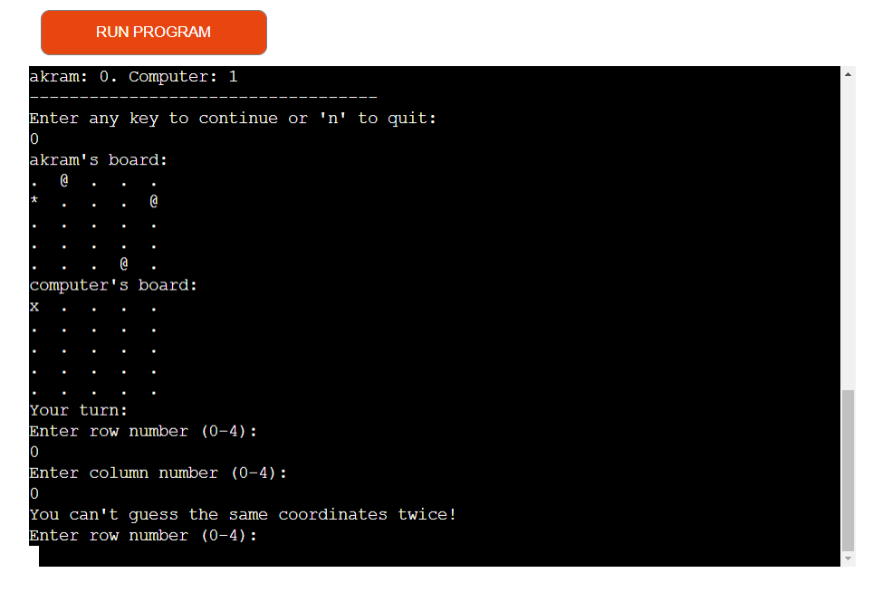
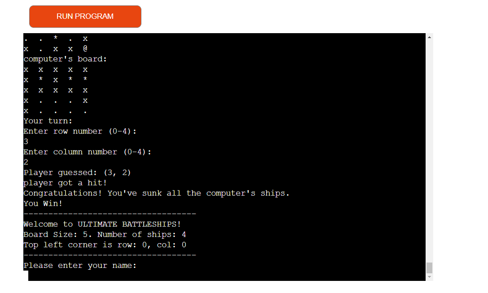
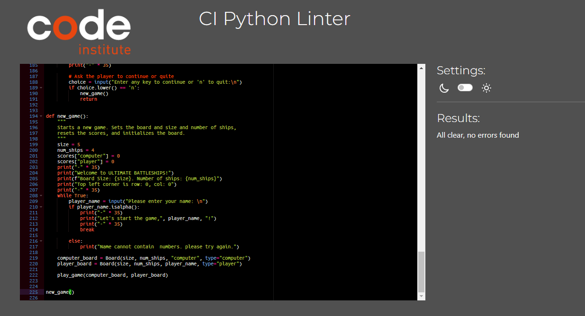

# ULTIMATE Battleships

## welcome to ULTIMATE Battleships! [view the live project .](https://ultimate-bs-6e9e1c8e1d23.herokuapp.com/)

Ultimate Battleships is a Python terminal game that runs on Heroku. 
Users can try to beat the computer by finding all of the computer's battleships before the computer finds theirs.

 Each battleship occupies one square on the board.

## How to play

Ultimate Battleships is based on the classic pen and paper game. You can read more about it [Wikipedia.](https://en.wikipedia.org/wiki/Battleship_(game))

In this version, the player enters their name, and two boards are randomly generated.

The player can see where their ships are, indicated by an '@' sign, but cannot see where the computer's ships are.

Guesses are marked on the board with an 'X', while hits are indicated by '*'.

The player takes turns to make guesses and try to sink the battleships, while at the same time, the computer tries to hit the player's ships.

The winner is the one who sinks all of their opponent's battleships first.

## Features

### Existing Features

   * Game start
      - Once the player enters their name, the game starts.
      - The game begins by granting the player's (name) board, followed by the computer's board.
    
   * Random board generation
      - Ships are randomly placed on both the player and computer boards.
      - The player cannot see where the computer's ships are.

   * Play against the computer.
   * Accepts user input. 
   * Maintenance of scores. 
   * Display of the player's guessed positions.
   * Indication of whether the guess was a hit or a miss. 
   * Option to continue playing or quit.

   

   * Input validation and error  Checking
      
      - The Name has to contain only alphabetic letters.

      - You must enter numbers.

      - You cannot enter coordinates outside the size of the grid.

      - You cannot enter the same guess twice.

      

      

      

      

   * End of the game.

     - If either the computer or the player sinks the other's ships, 
     the game finishes by declaring a winner.
     - After that, an option to start a new game is provided.

      

   * Data maintained in class instance.

## Future Features 

  * Allow player to select the board size and number of ships.

  * Allow the player to position ships themselves.

  * Have ships larger than 1x1.

## Data Model 

   I decided to use a Board class as my model. The Game creates two instances of the Board class to hold the player's and the computer's boards.

   The board class stores the board size, the number of ships, the positions of the ships, the guesses against that board, and details such as the board type (player's board or computer) and the player's name.
 

The class also has methods to assist in playing the game, such as a print method to display the current board, an add_ships method to place ships on the board, and an add_guess method to record guesses and determine their outcomes.

## Testing

I have manually tested this project by performing the following steps:
  
* Passed the code through a PFP8 linter and confirmed that there are no problems.

* Handling Invalid Inputs 

     * When playing the game, it's essential to provide valid inputs to ensure a smooth experience. Here are the rules regarding invalid inputs:

         -  Invalid Player Name:

            -  If the player enters a name containing non-alphabetic characters, an error message will be displayed: "Name cannot contain numbers. Please try again."

         - Invalid Guess Coordinates:

            - If the player enters non-numeric values for row or column guesses, an error will occur: "Guess column or row must be a number. Please try again."

         - Repeating Guesses:

           * If the player tries to guess the same coordinates twice, they will receive the following error: "You can't guess the same coordinates twice! Please try again."
         - Out-of-Bounds Coordinates:

           * If the player enters coordinates outside the range of 0 to 4, they will receive the error: "Values must be between 0 and 4! Please try again."
           Following these guidelines ensures a seamless gaming experience without encountering errors due to invalid inputs.
   
   
   * Tested in my local terminal and the Heroku terminal.

     

   ## Bugs 
   
   ### Solved Bugs

   * When I deployed the project, the game was never ending. I updated the play_game function to finish the game once the score reached the number of ships for either player, and then called the new_game function.

   * My populate_board function was not working properly because I hadn't structured the while statement properly

   ### Remaining bugs

   * No bugs remaining.

   ### Validator Testing
   * PEP8
      - No errors were returned from [PEP8](https://pep8ci.herokuapp.com/)

## Deployment 

 This project was deployed using [Heroku](https://dashboard.heroku.com/apps)

   *  Steps for deployment:
     
      - Fork or clone this repository in Visual Studio Code using the Code Institute provided template. 
      - Create a new heroku app
      - Set the buildbacks to python and nodeJS in that order
      - Link the heroku app to the repository
      - Click on Deploy

## Credits 

 *  [Heroku](https://dashboard.heroku.com/apps) for the deployment terminal 

* [PEP8](https://pep8ci.herokuapp.com/)
 for check the validated code 

* [Wikipedia](https://en.wikipedia.org/wiki/Battleship_(game)) for the details of the battleships game 
      
